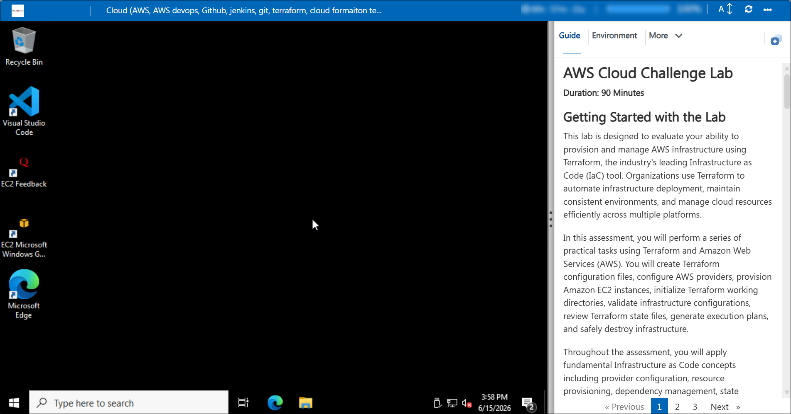
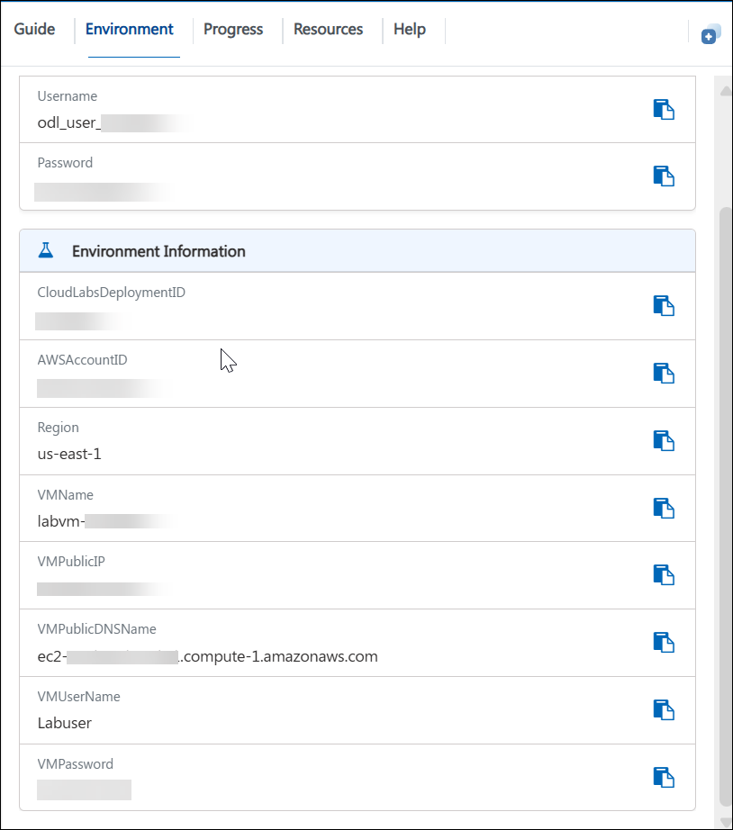
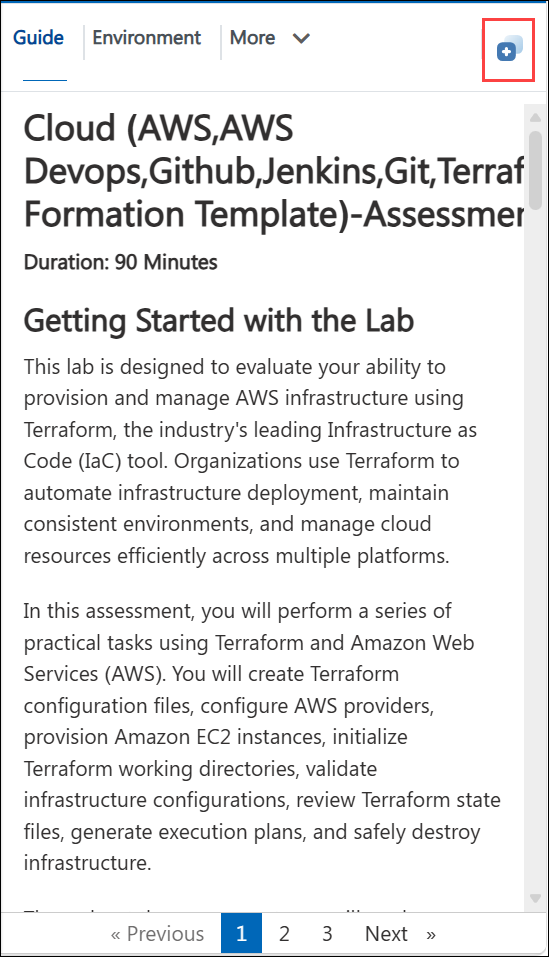
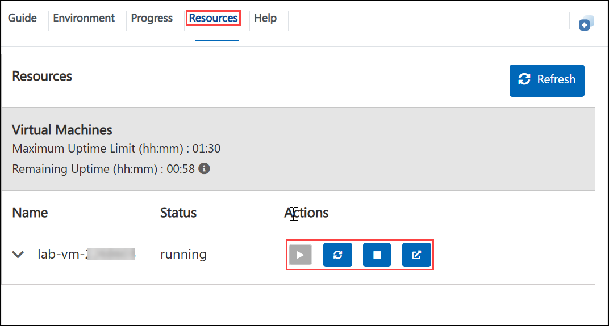
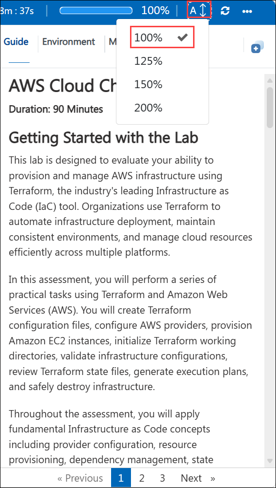

# **AWS Cloud Challenge Lab**

**Duration: 90 Minutes**

## **Getting Started with the Lab**

This lab is designed to evaluate your ability to provision and manage AWS infrastructure using Terraform, the industry's leading Infrastructure as Code (IaC) tool. Organizations use Terraform to automate infrastructure deployment, maintain consistent environments, and manage cloud resources efficiently across multiple platforms.

In this assessment, you will perform a series of practical tasks using Terraform and Amazon Web Services (AWS). You will create Terraform configuration files, configure AWS providers, provision Amazon EC2 instances, initialize Terraform working directories, validate infrastructure configurations, review Terraform state files, generate execution plans, and safely destroy infrastructure.

Throughout the assessment, you will apply fundamental Infrastructure as Code concepts including provider configuration, resource provisioning, dependency management, state management, execution planning, and infrastructure lifecycle operations.

By the end of the lab, you will have demonstrated your ability to deploy, validate, manage, and remove AWS infrastructure using Terraform following industry-standard practices commonly used by Cloud Engineers, DevOps Engineers, Site Reliability Engineers (SREs), and Cloud Operations teams.

---

# **Accessing Your Lab Environment**

Once you're ready to begin, your lab environment and assessment guides will be available directly within your browser.

## **Virtual Machine & Lab Guide**

Your virtual machine provides the tools required to complete the assessment activities, including Terraform, Visual Studio Code (VS Code), Git, and browser access to the AWS Management Console.

The lab guide provides step-by-step instructions and validation requirements for each task.

---

# **Exploring Your Lab Resources**

To view environment information, credentials, and resource details, navigate to the **Environment** tab.

You can find:

* AWS Console URL
* AWS Username
* AWS Password
* Deployment Information
* Resource Details

---

# **Utilizing the Split Window Feature**

For convenience, you can open the lab guide in a separate window by selecting the **Split Window** button from the top-right corner.

This allows you to follow instructions while working in the virtual machine or AWS Console simultaneously.

---

# **Using the Virtual Machine**

The provided virtual machine contains the tools required for the assessment.

Installed tools include:

* Terraform
* Visual Studio Code (VS Code)
* Git
* Web Browser
* AWS Tools for PowerShell

You may use VS Code to create and edit Terraform configuration files during the assessment.

---

# **Managing Your Virtual Machine**

You may Start, Restart, or Stop your virtual machine at any time using the **Resources** tab available within the lab environment.

---

# **Lab Guide Zoom In / Zoom Out**

To adjust the zoom level of the lab environment page, use the zoom controls located next to the session timer.

---

# **Lab Validation**

After completing each task, select the **Validate** button located within the Validation section of the lab guide.

* If validation succeeds, proceed to the next task.
* If validation fails, carefully review the error message and revisit the task instructions before attempting validation again.
* Ensure resources are created using the naming conventions specified within each exercise.
* Ensure Terraform files are saved in the required working directory before validation.

---

# **Support Contact**

The CloudLabs support team is available 24/7 throughout your lab experience.

### **Learner Support**

**Email Support:** [labs-support@spektrasystems.com](mailto:labs-support@spektrasystems.com)

**Live Chat Support:** https://cloudlabs.ai/labs-support

---

Click **Next >>** to begin the assessment.

