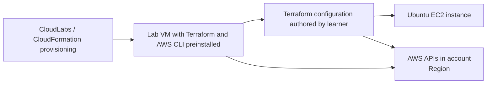

# Getting Started

## Lab scenario
In this challenge lab, you will use a pre-provisioned AWS lab environment to create and manage infrastructure with Terraform. The CloudFormation deployment for this lab has already prepared your learner workstation and prerequisites. Your hands-on work in this lab is limited to AWS and Terraform only.

You will connect to the lab environment, confirm the preinstalled tooling, and use Terraform to deploy a single Ubuntu EC2 instance of type `t3.micro`. After validating the deployment, you will safely destroy the infrastructure and confirm cleanup.

> [!Note]
> IAM permissions required for the learner workflow are already configured for you. Do not create or enter AWS credentials manually unless the lab explicitly instructs you to do so.

## Sign in
1. Open the AWS Console: <inject key="AwsConsoleUrl"></inject>
2. Sign in with the following lab credentials:
   - **IAM user name:** <inject key="IamUserName"></inject>
   - **IAM password:** <inject key="IamUserPassword"></inject>
3. Confirm that you are working in:
   - **AWS account:** <inject key="AwsAccountId"></inject>
   - **AWS Region:** <inject key="AwsRegion"></inject>
4. Keep your deployment reference available for this lab:
   - **Deployment ID:** <inject key="DeploymentID"></inject>

## Lab environment
Your lab environment includes a prebuilt lab VM that already has the required tools installed for this challenge:
- Terraform
- AWS CLI
- Git

For this lab, Git is available on the machine but is not part of the required workflow.

If you need to use the preconfigured CLI credentials on the lab VM, use the provided bootstrap environment file at:
- `$LAB_HOME/cloudlabs-creds.env`

Use the preconfigured lab environment rather than manually configuring new AWS access keys.

## Architecture
The lab environment is provisioned for you, and your task is to create only the learner-owned AWS resource with Terraform.

## What you will do
In this lab, you will:
- Use the provided AWS lab environment
- Create Terraform configuration from scratch
- Configure the AWS provider
- Define one EC2 instance resource
- Deploy one Ubuntu EC2 instance with instance type `t3.micro`
- Review Terraform plan and apply results
- Destroy the deployed infrastructure and verify cleanup

## Assessment objectives
By completing this lab, you will demonstrate that you can:
- Work from a preconfigured AWS lab workstation
- Use Terraform workflow commands such as `init`, `plan`, `apply`, and `destroy`
- Deploy an EC2 instance in AWS using Terraform
- Verify both deployment success and teardown completion

## Important scope notes
- CloudFormation is used only to provision the lab environment and prerequisites.
- You do not need to edit the environment provisioning template.
- Git, GitHub, and Jenkins are not part of this lab workflow.
- Focus only on AWS Terraform tasks described in the exercises.

## Before you begin
Before starting Exercise 1, make sure that:
- You can access the AWS Console successfully
- You are using the expected account and region
- Your lab VM is available
- Terraform and AWS CLI are accessible from the VM
- You are using the preconfigured permissions provided by the lab

## After publishing

> [!Note] These steps run **after** you push the template to CloudLabs — they verify CloudLabs can actually serve this lab guide to candidates.

- **Verify docs-proxy access:** open Templates → your template → **Lab Guide Settings** in <https://admin.cloudlabs.ai> and confirm CloudLabs can reach this repo via the docs proxy. If the repo is private, configure GitHub access at the template level.
- **Verify inline questions and inline validations:** sign in to <https://admin.cloudlabs.ai>, open your template, and walk through one full lab run to confirm every `<question>` and `<validation step="..."/>` renders correctly. Fix any that don't resolve.
